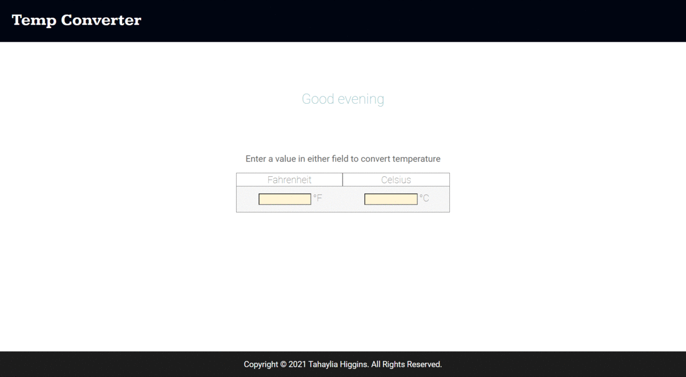

  

<h1>Temperature Converter Website</h1>

<h2>Overview</h2>

Website to convert fahrenheit to celsius and vice versa.
 

<h2>Live Link here:</h2> 
<a href="https://th876.github.io/Temperature-Converter/">Temperature Converter Website</a>

<h2>Features:</h2> 
<ul>
  <li>Visitors to the site are greeted good morning, good afternoon, good evening or good night based on their local time.</li>
  <li>Users enter number for fahrenheit to output the converted celsius degree and vice versa.</li>
</ul>

<h2>Dependency:</h2>
<ul>
  <li>Font from <a href="https://fonts.google.com/">Google Fonts</a></li>
  <li>Mockup created using <a href="https://www.adobe.com/products/xd.html?ef_id=CjwKCAjwh5qLBhALEiwAioodsx8DbW6CW2JrhX3hEtCTgV-K74P1FvgINLZUyOlRo9rllwnYWyQBpRoCWLQQAvD_BwE:G:s&s_kwcid=AL!3085!3!372954583385!b!!g!!!2075907083!76930640392">Adobe XD</a></li>
  <li> Favicon created using <a href="https://www.adobe.com/products/photoshop.html?sdid=KKQIN&mv=search&kw=photoshop&ef_id=Cj0KCQjw4v2EBhCtARIsACan3nzWa02yHOxxhoA2qyth0Ccx23VW6QLSgtmysrlXsdK-F58df6NXpr0aAmSXEALw_wcB:G:s&s_kwcid=AL!3085!3!442365419729!e!!g!!adobe%20photoshop%20home&gclid=Cj0KCQjw4v2EBhCtARIsACan3nzWa02yHOxxhoA2qyth0Ccx23VW6QLSgtmysrlXsdK-F58df6NXpr0aAmSXEALw_wcB">Adobe Photoshop</a></li> 
</ul>
